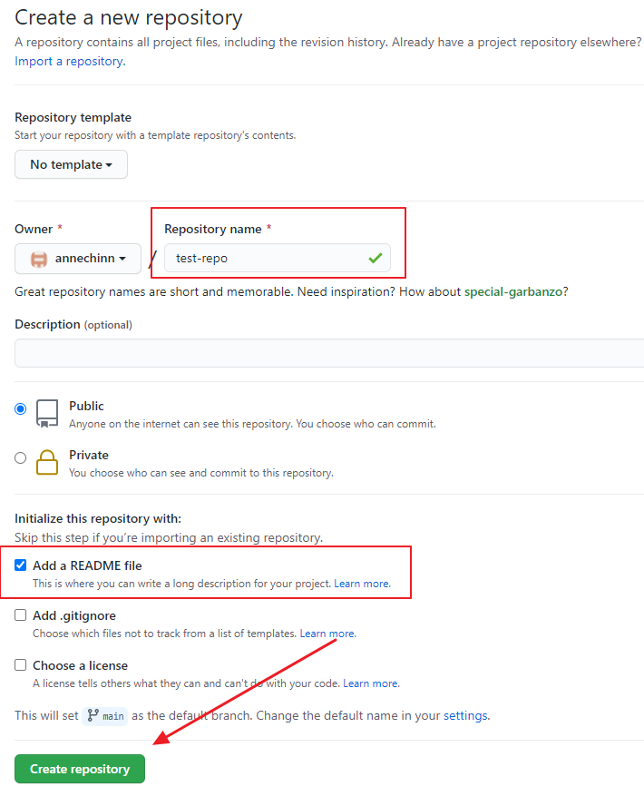

# Git/GitHub

### Cloning a GitHub Repository

The repositories we work with in this course will primarily be created through GitHub Classrooms when you accept an invitation for an assignment.  Whenever you want to work in a repository that already exists on GitHub, the first step is to **clone** the repository.

Cloning a repository creates a copy of a GitHub repository on your local computer and establishes a connection between the two repositories so that they can stay in sync.

#### 1. Get the GitHub repository URL

To clone a GitHub repository, you need to first go to the GitHub repository to get the repository URL. Just **click the Code button**, and then **click the clipboard icon** to copy the URL for the repo.


#### 2. Issue the git clone command on your local computer

To install the repository on your local computer, open a Git Bash shell, navigate to the parent directory where you want the repository folder to be created, and issue the git clone command. This will create the directory, containing a copy of the files that are in the GitHub repository at the time the clone executed.

```bash
git clone https://github.com/annechinn/test-repo.git
```

### Daily Work Habits/Commands

The following image depicts the process that occurs on your local computer, as well as the process of pushing your changes from your local repository to the connected GitHub repository.


This process of adding, committing \(on your local computer\) and then pushing changes to GitHub is known as the **ACP cycle** and it is repeated continually as you work on a project. 

In general, developers try to commit their work as often as possible. A typical cycle might be to commit your changes at the end of every day, or whenever you feel the changes you have made are at a stable point where you would like to be able to return to if the need arises.

One useful git command is **git status**, which will give you a list of the files that are currently untracked, meaning that they have not yet been added to the staging area with the git add command and which files have not been committed with the git commit command.

### Resources

This video is a good basic introduction to git and focuses on most of the topics we cover here. It shows some examples of going through the ACP cycle multiple times and using the git status command.




There are a lot of git commands. It can be overwhelming at first. Start slow, just trying to use the basic git add, commit, push, and status commands. These cover the majority of the use-cases while you are working with a repository that you are not sharing with other people.



The following two videos cover more than we need to know at this point, but are good for future reference.






#### 1b. Cloning a GitHub Repository Created By You 

This is one of the easier ways to create a new repository for a project you are starting. You start by creating the repository on GitHub, making sure to check the box that creates a **README.md** file so that there is at least one file in the repository before you clone it. Then, all you have to do is clone it as you did with the assignment repository scenario to create a copy on your local computer.

Here's a step-by-step walkthrough of creating a repository on GitHub and cloning it to my local computer.

First, **log into your GitHub account**, then **click on the Repositories section**, and then **click on the New button** to create a new repository.


Next, **enter the name** for the new repository, **check the Add a README file** check-box, and then **click the Create repository** button.



### Starting a new repository from your local computer

In some cases, you will have been working with a set of files, and you decide that you would like to start using git to track changes and store the repository on GitHub so that they will be backed-up.

In this scenario, you will create the git repository on your local computer first, and then create a repository on GitHub and initialize it with the files from your local repository.

#### Initialize local repository

To initialize the local git repository, you need to issue the **git init** command from a Git Bash shell. First, change directories into the project folder containing the files you want **git** to track, then issue the **git init** command.

This will create a folder named **.git** in the folder. This folder contains all of the information that git needs to track the changes you are making in your local repository. For this example, let's imagine we have a project folder named my-project that we want to add to git.

```bash
cd d:/my-new-project
git init
```

#### Add Files and Commit Changes

Next, you need to add and commit the files to your local repository. The git add . command will add all of the files in the folder to the staging area for the next commit. They are then ready to be pushed to a GitHub repository.

```bash
git add .
git commit -m"first commit"
```

#### Create a GitHub Repository to receive local files

Next, you need to create a repository on GitHub that will be linked to this repository. Unlike the previous example, where we were creating the repository first on GitHub, we do not need to create a README.md file for this repository. We are initializing it with whatever is already in the project folder from the local repository.

Click the create button to create the repository.


#### Push the Local Repository to GitHub

GitHub provides a set of commands that need to be issues from your local computer to add the files to the GitHub repository. 

1. The first command links the local repository with the GitHub repository.
2. The next command renames the master branch to main
3. The last command pushes the local main branch to the GitHub main branch.


The second step is a new requirement since the end of 2020, when GitHub made a policy decision to change the default name of the main branch from master to main to move away from the negative connotations of the term master.



Once this is done, you now have a local and GitHub repository.

### Keeping in Sync with the GitHub Repository

If you are working with a shared GitHub repository, where multiple people are working collaboratively on the same files, you will need to make sure that you are updating your local repository periodically with changes that have been committed by other people to the GitHub repository. 


You do this by issuing the git pull command. This will update your local repository with any changes. 

```bash
git pull
```

In some cases, you will have conflicts due to more than one person making changes in the same file, and the same lines of code. In this case you will have to resolve the conflicts manually using tools provided that show exactly where the conflicts occur and allowing you to modify the file to resolve the conflicts and commit the new merged version. This is something that people try to avoid by having people assigned to different parts of a project so there is less chance that changes will overlap.

