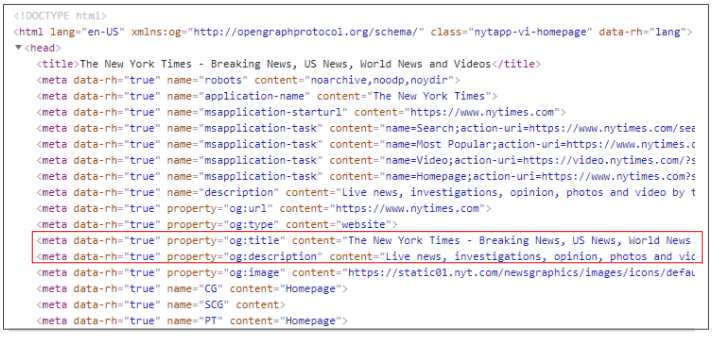

# Meta Section

## &lt;meta&gt;


This is not an area where you will need to make modifications, until you are doing more advanced settings.

The one exception is the title element, which is what is displayed in the browser tab.


```markup
<!DOCTYPE html>
<html lang="en">
<head>
    <meta charset="UTF-8">
    <meta http-equiv="X-UA-Compatible" content="IE=edge">
    <meta name="viewport" content="width=device-width, initial-scale=1.0">
    <title>Document</title>
</head>
<body>

</body>
</html>
```

Metadata is data about data. It is always contained within the `<head>` element. Data from this section will not be displayed on the page.

A lot of the meta elements are used to assist search engines to find the page and provide information for the search result.

If you search for NY Times on Google, you will see the following result. The text in red is taken from the meta attributes title and description.




